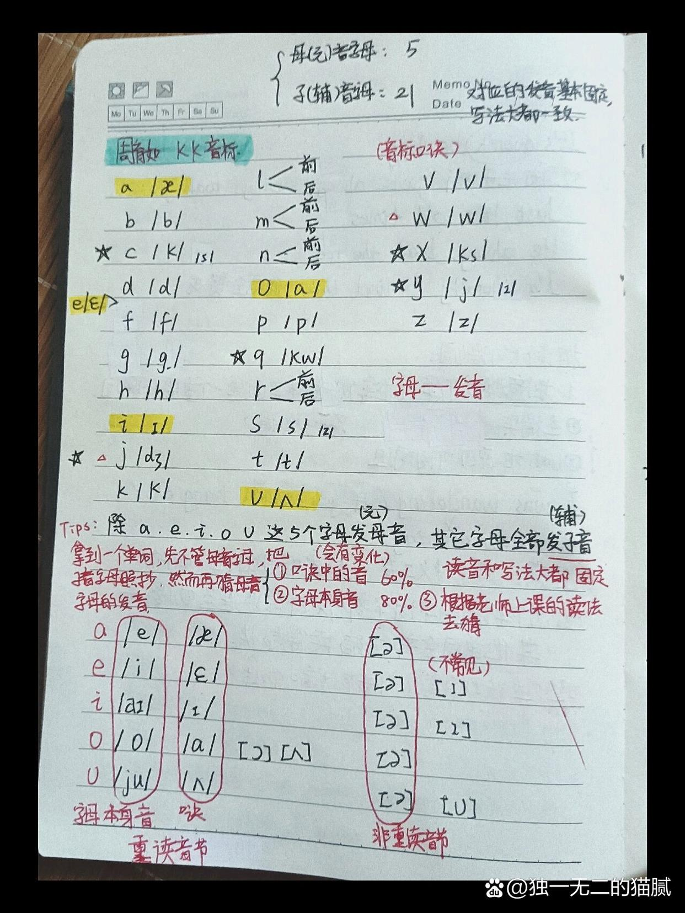
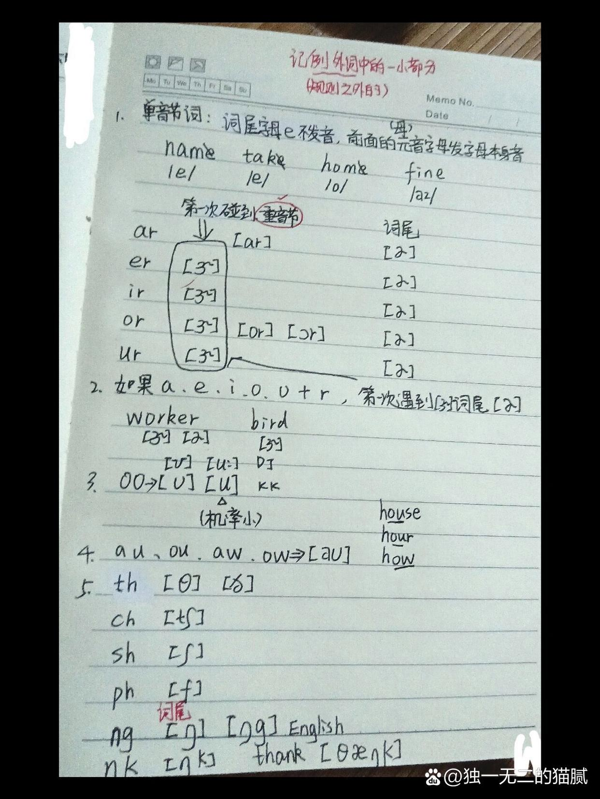
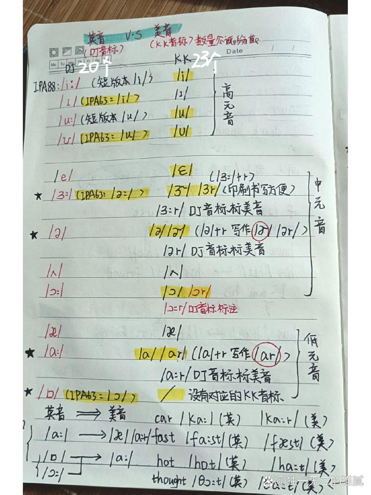
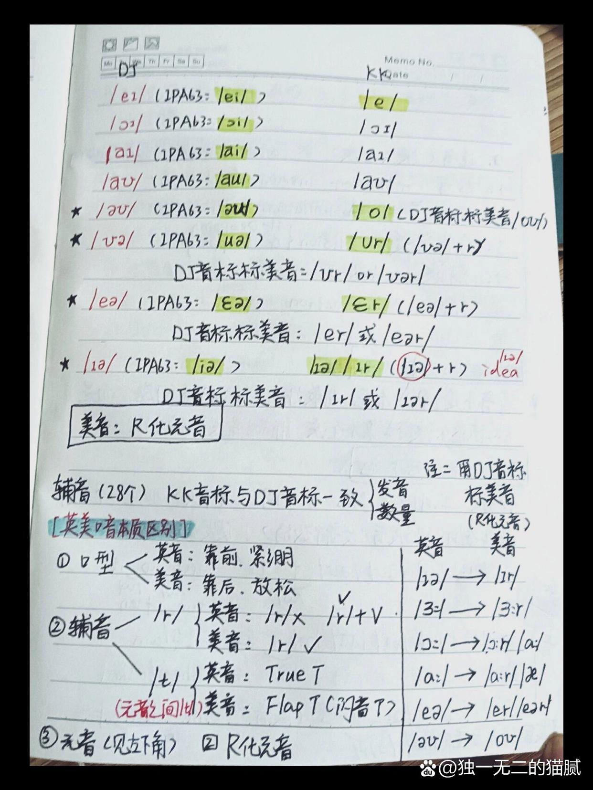

> | 1    |   [a]   |    /æ/    | aa爱爱（重）                                             |
> | ---- | :-----: | :-------: | -------------------------------------------------------- |
> | 2    |   [b]   |    /b/    | bb啵啵                                                   |
> | 3    |   [c]   |    /k/    | cc可可                                                   |
> | 4    |   [d]   |    /d/    | dd得得                                                   |
> | 5    | **[e]** |  **/ɛ/**  | **ee哎哎(轻)**                                           |
> | 6    |   [f]   |    /f/    | ff夫夫                                                   |
> | 7    |   [g]   |    /g/    | gg哥哥                                                   |
> | 8    |   [h]   |    /h/    | hh赫赫                                                   |
> | 9    | **[i]** |  **/ɪ/**  | **ii 奕奕**                                              |
> | 10   |   [j]   |   /dʒ/    | jj句句                                                   |
> | 11   |   [k]   |    /k/    | kk科科                                                   |
> | 12   |   [l]   |    /l/    | (1)  前面    <u>LL乐乐</u>     (2) 后面  <u>LL哦哦</u>   |
> | 13   |   [m]   |    /m/    | (1)前面 <u>mm 么么</u>   (2)后 <u>mm  嗯嗯</u>（en闭口） |
> | 14   |   [n]   |    /n/    | (1)前面 nn呢呢 （2）后 nn恩恩（eng开口）                 |
> | 15   | **[o]** |  **/a/**  | **oo啊啊（长)**                                          |
> | 16   |   [p]   |    /p/    | pp破破                                                   |
> | 17   |   [q]   |    [q]    | qq阔阔                                                   |
> | 18   |   [r]   |    /r/    | (1)前面 rr若若 (2)后 rr饿儿饿儿                          |
> | 19   |   [s]   |    /s/    | ss丝丝                                                   |
> | 20   |   [t]   |    /t/    | tt特特                                                   |
> | 21   | **[u]** | **/ ʌ /** | **uu啊啊（短）**                                         |
> | 22   |   [v]   |   / v /   | vv物物（咬嘴唇）                                         |
> | 23   |   [w]   |    /w/    | ww物物                                                   |
> | 24   |   [x]   |   /ks/    | xx克斯                                                   |
> | 25   |   [y]   |   / j /   | yy耶耶                                                   |
> | 26   |   [z]   |    /z/    | zzzi                                                     |

>  注：加粗标注为：元音   元音会有变化 举例：doctor 第一个o重读,但是第二个o直接读成 ə/呃。
 -  		 a [e] [æ]   				 e [i] [ɛ]     
 -  		 i [aɪ] [ɪ]  				   o [o] [a]    		u [ju] [ʌ]

